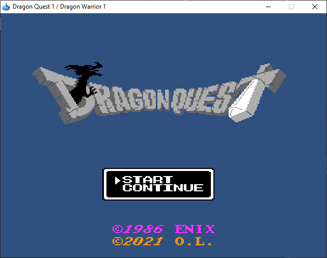
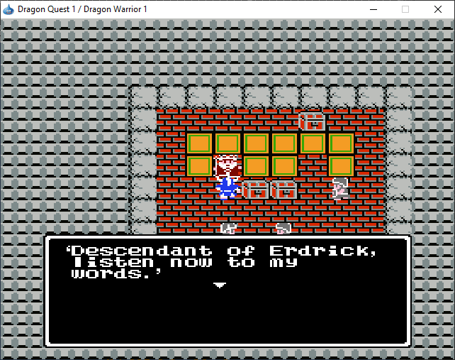
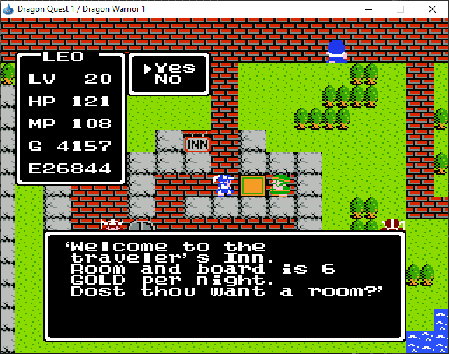
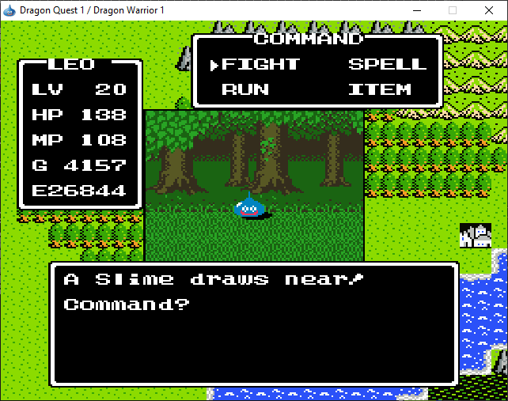
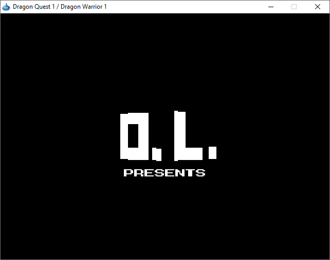

# Java Dragon Quest 1

A Java remake/prototype inspired by Dragon Quest 1, implemented with standard Java APIs only:
- Java 2D (rendering)
- AWT/Swing (window + input)
- Java Sound/MIDI (audio)

No external gameplay libraries are required.

## Project Scope

This repository currently contains two gameplay code paths:
- `src/dq1`: the main Dragon Quest style game implementation (tile map RPG).
- `src/mmorpg`: a separate console/MMORPG-flavored prototype module.

The configured application entry point is `main.Main` (`src/main/Main.java`), which launches the `dq1` path.

## Requirements

- JDK 8+ (project properties currently reference JDK 25 in NetBeans metadata)
- Windows, Linux, or macOS with desktop Java runtime

## Build And Run

### Option 1: Run prebuilt JAR

If already built:

```powershell
java -jar dist/JavaDragonQuest1.jar
```

### Option 2: Build with Ant (included in repo)

```powershell
./apache-ant-1.10.14/bin/ant clean jar
java -jar dist/JavaDragonQuest1.jar
```

### Option 3: Run from IDE

Open as a NetBeans/Java project and run `main.Main`.

## Controls (Default)

- Arrow keys: Move
- `X`: Confirm/Interact
- `Z`: Cancel/Menu back

The game also includes in-game menus for display/settings/control remapping.

## Saves

Save files are serialized to the user home directory:
- `~/save_1.dat`
- `~/save_2.dat`
- `~/save_3.dat`
- additional slots may exist in menu logic depending on branch changes

## Repository Layout

- `src/main`: application bootstrap
- `src/dq1/core`: primary game engine and gameplay systems
- `src/mmorpg`: secondary/prototype game model
- `assets/res`: maps, events, images, audio, and data tables (`*.inf`)
- `docs`: rewritten design and technical documentation

## Documentation

- Game Design Document: `docs/GDD.md`
- Technical Design: `docs/TECHNICAL_DESIGN.md`
- UML (PlantUML): `docs/uml/class_diagram.puml`, `docs/uml/runtime_flow.puml`

## Screenshots







## References

- http://www.realmofdarkness.net/dq/nes-dw/
- https://gamefaqs.gamespot.com/nes/563408-dragon-warrior/faqs/61640
- https://gamefaqs.gamespot.com/nes/563408-dragon-warrior/faqs/10739
